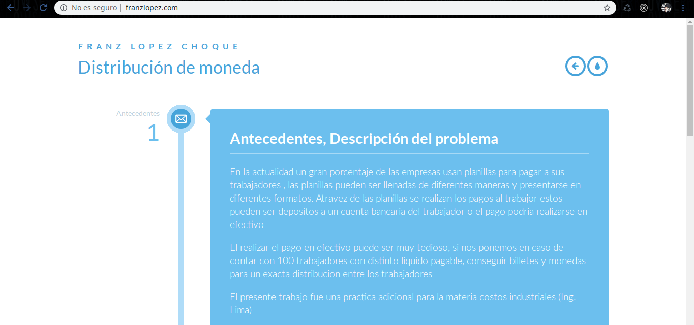

#### Entrada:
Mediante un formulario se sube un archivo con extenscion xlsx (./media/ejemplo/sample.xlsx)

#### Salida:
Luego de realizar los calculos el servidor retorna un archivo xlsx con el detalle de fraccionamiento.

#### Detalles tecnicos:
```sh
$ echo "127.0.1.1       www.franzlopez.com" >> /etc/hosts
$ docker-compose up
```

#### Capturas de pantalla

Parte inicio



-


